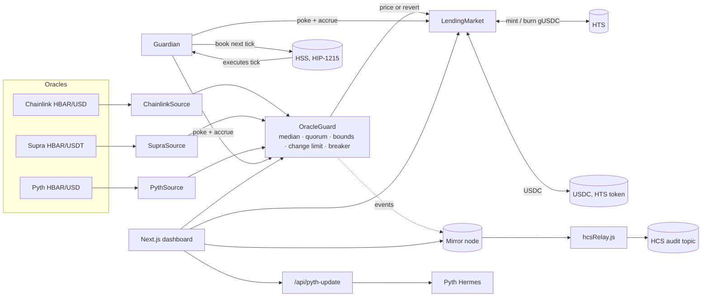

# Guarded Lending: a Scaffold-HBAR template

An isolated lending market on Hedera that **prices through several independent oracles and stops instead of trusting a forged price.**

Lenders supply USDC and receive **gUSDC**, a native HTS token. Borrowers lock HBAR and borrow USDC. Every price-dependent action goes through an `OracleGuard` that takes the median of **Chainlink, Supra and Pyth**, requires a quorum to agree, and trips a circuit breaker when they don't. A **Guardian** contract re-runs the check on a timer it books itself with the **Hedera Schedule Service** (HIP-1215), and a relayer mirrors every oracle decision to a **Hedera Consensus Service** topic.

```bash
npm create scaffold-hbar@latest -- --template yeziR4/guarded-lending
```

## Why this template exists

On 11 July 2026 Bonzo Lend, the largest lending protocol on Hedera, lost about $9M. Bonzo's contracts worked as designed. The Supra oracle verifier accepted a price update carrying an all-zero signature, and the attacker used it to value about 250 SAUCE of collateral some 10¹² times too high, then borrowed out the pools ([incident report](https://bonzo.finance/blog/bonzo-lend-incident-report-oracle-provider-exploit)). Lending was still paused when this template was written.

The lesson is general: a protocol that trusts one oracle inherits every bug in that oracle. This template is the starting point we would want for a lending app on Hedera after that incident.

- Price is the **median** of independent providers, so one bad source cannot move it.
- A **quorum** must agree within a tolerance, so two disagreeing sources halt pricing instead of being averaged.
- **Absolute bounds** and a **per-step change limit** reject implausible values, however they were signed.
- A tripped breaker blocks borrowing, collateral withdrawal and liquidation, but leaves repaying, supplying and adding collateral open.
- It resets itself after a healthy cooldown. There is no admin key that can force a price.

`test/BonzoReplay.t.sol` replays the attack against the same market code twice: once wired to a single feed (the pool is drained), once through the guard (the attack reverts). See [docs/oracle-guard.md](docs/oracle-guard.md).

## What's inside

| Piece | What it shows | Hedera / ecosystem surface |
| --- | --- | --- |
| `OracleGuard` | Median, quorum, deviation, bounds, change limit, self-resetting breaker | Chainlink, Supra and Pyth on Hedera |
| `ChainlinkSource`, `SupraSource`, `PythSource` | One small adapter per provider, all normalized to 18 decimals | Push feeds (Chainlink, Supra) and a pull feed (Pyth) |
| `LendingMarket` | Supply, borrow, repay, liquidate, utilization-based interest, fail-closed pricing | **HTS**: creates the gUSDC receipt token, mints and burns it, associates with USDC |
| `Guardian` | Keeperless timer: pokes the guard and accrues interest, then books its own next run | **HSS**: HIP-1215 scheduled contract calls |
| `hcsRelay.js` | Publishes every guard decision to a topic only it can write to | **HCS**: ordered, timestamped audit log |
| Next.js dashboard | Live source readings, breaker state, lend/borrow/liquidate flows, audit log | Mirror node REST, IHRC-719 token association |
| `/api/pyth-update` | Server-side Hermes proxy (keeps the Pyth API key out of the browser) | Pyth Core (post-Aug 2026 API) |

## Quick start: see it live in two minutes

The template ships wired to a shared deployment on Hedera testnet, so the dashboard works before you deploy anything.

```bash
npm create scaffold-hbar@latest -- --template yeziR4/guarded-lending
cd <your-app>
npm run next:dev
```

Open http://localhost:3000. You should see three oracle rows. Chainlink and Supra show **Ok**. Pyth shows **Stale** until someone pushes an update (see [Pyth](#pyth-is-optional)). The median is shown with "2 of 3 agree", and the Guardian shows its next scheduled run.

To use the market, connect a wallet on Hedera testnet (MetaMask with the Hashio RPC works). Get test HBAR from the [Hedera Portal faucet](https://portal.hedera.com/faucet) and test USDC from the [Circle faucet](https://faucet.circle.com) (choose Hedera testnet). The UI walks you through **associating** USDC and gUSDC with your account, which Hedera requires before an account can hold a token.

### Prerequisites

- Node.js ≥ 20.18.3 and npm
- [Foundry](https://book.getfoundry.sh/getting-started/installation) (`forge`, `cast`)
- `make`, used by the base template's lint and deploy wrappers. On Windows, use WSL or Git Bash with make, or run the plain `forge` commands shown below.

## Architecture



**Request path.** `borrow()` accrues interest, then calls `OracleGuard.poke()`, which reads all sources, classifies them, and accepts or rejects the median. It then calls `price()`, which reverts if the breaker is tripped or the price is stale. A forged price never reaches the collateral math: the whole transaction reverts.

**Persistence.** Because a failed check reverts the user's transaction, the trip itself is rolled back with it. The trip is persisted by anyone calling `poke()` directly: the Guardian on its timer, the dashboard's "Run check" button, or a monitoring bot. `poke()` never reverts.

**Units.** Inside the Hedera EVM, HBAR amounts are **tinybars** (8 decimals). JSON-RPC transaction values are **weibars** (18 decimals). The market stores collateral in tinybars; the frontend multiplies by 10¹⁰ when sending `value`. See [docs/hedera-notes.md](docs/hedera-notes.md).

## Deploy your own

1. **Fund a testnet account** at [portal.hedera.com](https://portal.hedera.com) with an **ECDSA** key.

2. **Import the key into Foundry's encrypted keystore.** The key never goes into a `.env` file:

   ```bash
   npm run foundry:account:import      # name it e.g. hedera-testnet; paste the HEX key, set a password
   ```

   The key prompt is hidden: paste once and press Enter. Use the **HEX** private key from the portal, not the DER-encoded one.

3. **Deploy the contracts** (sources, guard, market, Guardian):

   ```bash
   cd packages/foundry
   forge script script/Deploy.s.sol --rpc-url hedera_testnet --account hedera-testnet --broadcast --slow --legacy
   node scripts-js/generateTsAbis.js   # refreshes packages/nextjs/contracts/deployedContracts.ts
   ```

   `npm run foundry:deploy -- --network hedera_testnet` does the same through the base template's `make` wrapper.

4. **Set up the Hedera-native parts.** This creates the gUSDC token (HTS), takes the first price reading, and starts the Guardian (HSS):

   ```bash
   npm run setup -- --network hedera_testnet --keystore hedera-testnet
   ```

   These calls touch system contracts that do not exist in Forge's local script simulation, so they run as plain transactions after deployment. The script is idempotent; rerun it after a partial failure. It prints a HashScan link per step.

5. **Start the audit relayer** (optional):

   ```bash
   npm run relay -- --keystore hedera-testnet
   ```

   The first run creates the topic and prints its id. Put it in `packages/nextjs/.env.local` as `NEXT_PUBLIC_AUDIT_TOPIC_ID`, and pass `--topic <id>` on later runs.

### Costs on testnet

| Step | Approx. HBAR |
| --- | --- |
| Deploy 6 contracts | ~5 |
| `initialize` (HTS token creation, 1 HBAR kept as renewal reserve) | ~15 sent, remainder refunded |
| Guardian tick (hourly by default) | ~0.18 each, paid from the Guardian's balance |
| HCS message | < 0.01 each |

Guardian funding **cannot be withdrawn**: the contract has no owner. Fund it for the period you want it to run, and top it up by sending HBAR to it.

## Configuration

**Deployment** (`script/Deploy.s.sol`, all overridable by environment variable):

| Variable | Default | Meaning |
| --- | --- | --- |
| `GUARD_QUORUM` | 2 | Sources that must agree (must be a strict majority) |
| `GUARD_MAX_DEVIATION_BPS` | 500 | Max distance from the median to count as agreeing (5%) |
| `GUARD_MAX_CHANGE_BPS` | 2000 | Max move vs the last accepted price per check (20%) |
| `GUARD_COOLDOWN` | 1800 | Seconds of continuous health before a tripped breaker resets |
| `GUARD_MAX_PRICE_AGE` | 7200 | Oldest accepted price the market will use |
| `GUARD_MIN_PRICE_E18` / `GUARD_MAX_PRICE_E18` | $0.001 / $100 | Absolute sanity band |
| `CHAINLINK_MAX_AGE`, `SUPRA_MAX_AGE`, `PYTH_MAX_AGE` | 2h, 2h, 10m | Per-source staleness limits |
| `PYTH_MAX_CONF_BPS` | 200 | Reject Pyth prices with a confidence interval over 2% |
| `GUARDIAN_INTERVAL`, `GUARDIAN_GAS_LIMIT` | 3600, 400000 | Tick cadence and gas per scheduled tick |

Risk parameters (LTV 65%, liquidation threshold 80%, bonus 5%, close factor 50%, 2% + 20%×utilization APR) are set in the same script. The constructor rejects combinations where the liquidation bonus would create bad debt.

**Frontend** (`packages/nextjs/.env.local`):

| Variable | Needed for |
| --- | --- |
| `PYTH_API_KEY` | Refreshing the Pyth source from the dashboard (server-side only) |
| `NEXT_PUBLIC_AUDIT_TOPIC_ID` | Showing the HCS audit log |
| `NEXT_PUBLIC_WALLET_CONNECT_PROJECT_ID` | WalletConnect in production |

### Pyth is optional

Since the Pyth Core upgrade (26 Aug 2026), Hermes requires an API key. Without one, the Pyth source is simply stale. The guard excludes it and runs 2-of-3 on Chainlink and Supra, which is the degradation the design is meant to handle. With a key in `PYTH_API_KEY`, "Refresh Pyth" fetches a signed update through `/api/pyth-update` and submits it on-chain, and all three sources count.

## Testing

```bash
npm run foundry:test            # 45 unit tests, offline, including the Bonzo replay and a fuzz test
npm run foundry:test:testnet    # runs the real guard against live Hedera testnet feeds
scripts/check-gate.sh --local   # bounty gate: fresh scaffold, lint, tests, build, boot, routes
```

Unit tests replace HTS (`0x167`) and HSS (`0x16b`) with small mocks (`test/mocks`), so they are deterministic and need no network. The mocks enforce the Hedera behaviour the contracts depend on: the supply key on mint and burn, and the rule that a contract can only authorize itself as auto-renew account. The real services are exercised by the testnet deployment below.

## Extending

- **Add a source.** Implement `IPriceSource.latest()`: revert on data the provider marks unusable, and return an 18-decimal price and a unix timestamp. Add it to `Deploy.s.sol` with its own max age, and add a slot in `hooks/lending/useOracleGuard.ts`. Up to five sources; quorum must stay a strict majority.
- **Different collateral.** Any asset with at least three independent feeds on Hedera. Change the source configs and the decimals conversion in `LendingMarket._collateralValue`.
- **Reuse only the guard.** `OracleGuard` has no dependency on the market. Any contract can call `poke()` then `price()`.

## Testnet deployment

| Contract | Address |
| --- | --- |
| OracleGuard | [`0x35987868E2677B7F778888B32c4db30Ad812BbE3`](https://hashscan.io/testnet/contract/0x35987868E2677B7F778888B32c4db30Ad812BbE3) |
| LendingMarket | [`0x3cd26C4d74Ec3e96b190195Df2084C63901d03b5`](https://hashscan.io/testnet/contract/0x3cd26C4d74Ec3e96b190195Df2084C63901d03b5) |
| gUSDC (HTS) | [`0.0.10760610`](https://hashscan.io/testnet/token/0.0.10760610) |
| Guardian | [`0x7922e3B006B5b15E48cEA1C974F562fCd15FaEd3`](https://hashscan.io/testnet/contract/0x7922e3B006B5b15E48cEA1C974F562fCd15FaEd3) |

Proof-of-transaction (the market's first live oracle check):
[`0x3d6df3cf…d19a`](https://hashscan.io/testnet/tx/0x3d6df3cfde1e2f726d939996dfb3774d1499d9dad50db37bf7e1deaaab61d19a)

## Security notes

This is a template, not audited production code.

- **Liveness vs safety.** The guard deliberately prefers halting to guessing. If two providers go down at once, borrowing stops until they recover and a cooldown passes.
- **Supra quotes HBAR/USDT**, not USD. The 5% tolerance absorbs the normal basis. A USDT depeg shows up as Supra disagreeing, which is the intended behaviour.
- **Collusion.** A majority of providers compromised at the same time cannot be detected by a median. The breaker then halts on disagreement if the forged prices differ, and the change limit plus bounds still cap what a coordinated move can do in one step.
- **The HCS log** is an audit trail, not an input. Nothing on-chain reads it.

More in [docs/oracle-guard.md](docs/oracle-guard.md) and [docs/hedera-notes.md](docs/hedera-notes.md). Agents: start with [AGENTS.md](AGENTS.md).

## License

MIT
